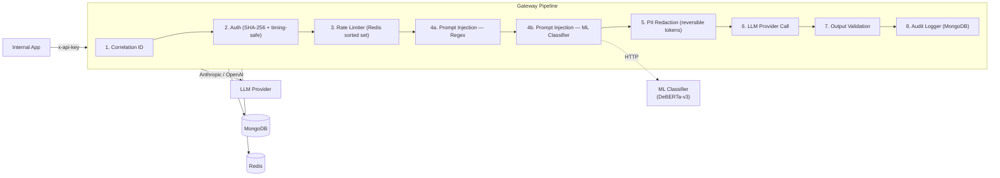

# SecureLLM Gateway

**Production-grade security proxy for LLM providers.**

SecureLLM Gateway sits between your applications and upstream LLM APIs (OpenAI, Anthropic), enforcing authentication, rate limiting, prompt-injection detection, PII redaction, output validation, and comprehensive audit logging — so your team can ship AI features without embedding security logic in every service.

---

## Quick Start

```bash
# 1. Clone and configure
cp .env.example .env
# Edit .env with your provider keys (OPENAI_API_KEY, ANTHROPIC_API_KEY, etc.)

# 2. Start everything
docker-compose up --build

# 3. Seed test API keys
npm run seed

# 4. Health check
curl http://localhost:3000/healthz

# 5. Send a chat request
curl -X POST http://localhost:3000/v1/chat \
  -H 'Content-Type: application/json' \
  -H 'x-api-key: test-client-key-123' \
  -d '{"model":"gpt-4o","messages":[{"role":"user","content":"Hello"}],"max_tokens":100}'
```

---

## Environment Variables

| Variable | Required | Default | Description |
|---|---|---|---|
| `PORT` | No | `3000` | HTTP port the gateway listens on |
| `MONGO_URI` | No | `mongodb://localhost:27017/securellm` | MongoDB connection string |
| `REDIS_URL` | No | `redis://localhost:6379` | Redis connection string |
| `OPENAI_API_KEY` | No | — | OpenAI API key for `gpt-4o` model routing |
| `ANTHROPIC_API_KEY` | No | — | Anthropic API key for `claude-3-5-sonnet` model routing |
| `RATE_LIMIT_WINDOW_MS` | No | `60000` | Sliding-window duration in milliseconds |
| `RATE_LIMIT_MAX` | No | `30` | Maximum requests allowed per window |
| `CLASSIFIER_URL` | No | `http://classifier:8000` | ML classifier microservice URL for prompt injection detection |
| `NODE_ENV` | No | `development` | `development` · `production` · `test` |

> When running via `docker-compose`, `MONGO_URI`, `REDIS_URL`, and `CLASSIFIER_URL` are automatically overridden to point at the containerized services.

---

## Architecture



---

## Security Architecture

### 1. Authentication

API keys are hashed with SHA-256 before storage in MongoDB. Incoming keys are hashed at request time and compared to stored hashes using a constant-time algorithm (`timingSafeEqual`) to prevent timing-based side-channel attacks. No plaintext key is ever persisted or logged.

### 2. Rate Limiting

A sliding-window counter backed by Redis sorted sets enforces per-key request quotas. The default limit is 30 requests per 60-second window and is configurable both globally (via `RATE_LIMIT_MAX` / `RATE_LIMIT_WINDOW_MS`) and per key (via the `rateLimit` field on an API key record).

### 3. Prompt Injection Detection (Dual-Layer)

Prompt injection detection uses a two-layer defense-in-depth architecture:

**Layer 1 — Regex (fast, deterministic):** Inbound messages are scanned against three categories of regex-based patterns: **role-override** attempts (e.g., "ignore previous instructions"), **delimiter/encoding injection** (e.g., base-64 encoded directives, markdown fences used to hide payloads), and **jailbreak patterns** (e.g., "DAN" prompts, "developer mode"). This layer runs in <1ms and catches known English-language patterns.

**Layer 2 — ML Classifier (smart, language-agnostic):** If regex passes, the message is sent to a Python/FastAPI microservice running a fine-tuned [DeBERTa-v3-base](https://huggingface.co/protectai/deberta-v3-base-prompt-injection-v2) model. The model was fine-tuned on ~1,600 samples including multilingual attacks (German, Spanish, Hebrew, Arabic, Japanese, Korean, Russian, French, Italian), creative writing wrappers, Unicode lookalike substitutions, and leetspeak. Only the top 3 of 12 encoder layers were unfrozen during training to preserve the base model's existing injection knowledge while learning new attack patterns.

| Metric | Score |
|---|---|
| Precision | 0.972 |
| Recall | 0.904 |
| F1 | 0.936 |
| Accuracy | 0.944 |

The ML layer uses a confidence threshold of 0.85 and has a 2-second timeout — if the classifier is unavailable, the gateway degrades gracefully to regex-only mode. All detections (both layers) are recorded in the audit log.

### 4. PII Redaction

A reversible, token-based redaction pipeline replaces sensitive data — email addresses, Israeli and international phone numbers, and Israeli National ID numbers (validated with a check-digit algorithm) — with opaque tokens before forwarding to the LLM. The original-value → token mapping is preserved in the audit record, allowing authorized reversal when needed while ensuring PII never reaches the upstream provider.

### 5. Output Validation

LLM responses are scanned for leaked secrets including API keys, JWTs, AWS access keys, private key blocks, and injection-echo patterns. If the response contains potentially unsafe content, it is blocked before reaching the client and the incident is recorded in the audit log.

### 6. Audit Logging

Every request produces a MongoDB audit record containing: timestamp, API key ID, model, SHA-256 hashes of request and response bodies, list of detected threats, PII token map, end-to-end latency, HTTP status code, and a correlation ID for distributed tracing.

### 7. Secrets Handling

All provider API keys are loaded exclusively from environment variables (validated at startup via Zod). Structured logging through Pino uses redaction paths to scrub sensitive fields. A `.gitleaks.toml` configuration (when present) enables pre-commit secret scanning to prevent accidental credential commits.

---

## API Endpoints

| Method | Path | Auth | Description |
|---|---|---|---|
| `GET` | `/healthz` | None | Liveness / readiness probe |
| `POST` | `/v1/chat` | `x-api-key` | Send a chat completion request through the security pipeline |
| `GET` | `/v1/audit` | `x-api-key` (admin) | Query audit log records (requires admin role) |

---

## Running Tests

```bash
npm run test
```

Tests use [Vitest](https://vitest.dev/) and run without external dependencies (MongoDB/Redis are mocked).

---

## Known Limitations

- **ML classifier adds latency** — The DeBERTa-v3 model adds ~200ms per request on CPU. For latency-sensitive deployments, consider model distillation to a smaller architecture or GPU inference.
- **PII patterns tuned for Israeli formats** — National ID validation uses the Israeli check-digit algorithm; other countries' ID formats are not covered.
- **Single Redis instance** — Rate limiting relies on one Redis node. For high availability, deploy Redis Sentinel or Redis Cluster.
- **No request size limits** — Beyond Express built-in defaults, there are no explicit payload-size caps. Consider adding `express.json({ limit: '1mb' })` for production.
- **No TLS termination** — The gateway serves plain HTTP and is expected to run behind a reverse proxy (nginx, AWS ALB, Cloudflare Tunnel) that handles TLS.
- **Output validation covers known patterns** — Novel exfiltration techniques or obfuscated secret formats may not be caught by the current regex set.
- **No streaming support** — The gateway waits for the full LLM response before running output validation. SSE streaming with chunk-level validation would reduce time-to-first-token.
